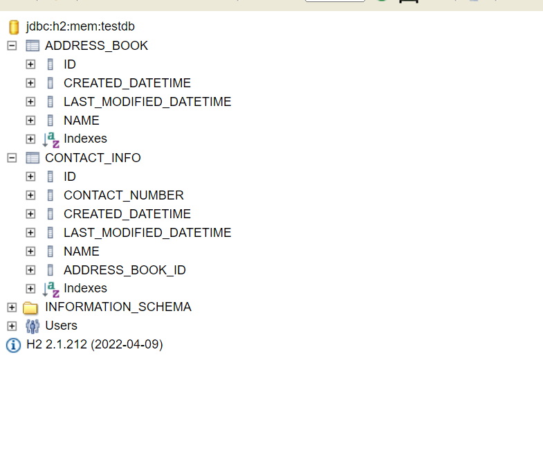

#Address Book Service

This application is responsible to maintain address book of all customers holding valid contact information.

- Address book will hold the name and contact numbers of contact entries.
- Created REST APIs which will have endpoints for the following 
  - Users will be able to add new contact entries.
  - Users will be able to remove existing contact entries.
  - Users will be able to print all contacts in an address book.
  - Users should be able to maintain multiple address books.
  - Users should be able to print a unique set of all contacts across multiple address books.

#Technologies used for this application

This application created using below technologies 

      - Java 8
      - Maven for building the application
      - Spring Boot for designing all the API's
      - Spring Data JPA for all CRUD operation
      - H2 in-memory database for storing the data
      - Swagger for API's documentation
      - Docker for containarizing the application

#Database Design

As per the BRD document we need to consider two aspects while processing and storing the data. 
There are two main objects i.e. Address Book and Contact information. 
Address Book will be holding all the information related to address book 
and Contact Information table will be holding all the data related to customer contact. 

Below is the database diagram which will explain the details regarding database object.

#Want to test locally ?

### Pre-requisite
- Make sure Java 8 version is installed
- Install Maven
- Install Docker Desktop (optional)

### Installation process

- Go to project directory and enter command: <b>mvn clean package</b>
- After the build is successful go to the target directory and copy the jar named address-book-service.jar to one of the directory.
- Now run "java -jar address-book-service.jar" in command prompt. After the service is up now you are ready to use the service.

You can go through the list of available API's and API's documentation 
using below Swagger UI link once your service is up in your local.

Link:http://localhost:8080/swagger-ui/index.html

In case you have installed docker and interested to deploy the image in docker.

- go to the project directory and to build the image type command: docker build
- To run the image type command: docker run -d -p 8090:8090 --name <image-name>
- Now you can see the running container using docker ps.

